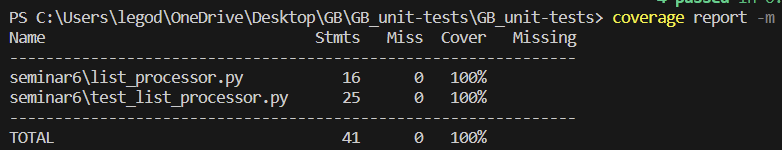

- [**Код программы**](https://github.com/legodark-hub/GB_unit-tests/blob/main/seminar6/list_processor.py)

- [**Код тестов**](https://github.com/legodark-hub/GB_unit-tests/blob/main/seminar6/test_list_processor.py)

- **Отчет о покрытии тестами**

- **Объяснение того, какие сценарии покрыты тестами и почему вы выбрали именно эти сценарии.**

Тесты `test_compare_lists_greater_first` и `test_compare_lists_greater_second` проверяют сценарии, когда среднее значение первого списка больше среднего значения второго списка и наоборот соответсвенно. 

Тест `test_compare_lists_equal`проверяет сценарий, когда средние значения обоих списков равны. 

Тест `test_compare_lists_empty_lists` проверяет сценарий, когда оба списка пусты. 

